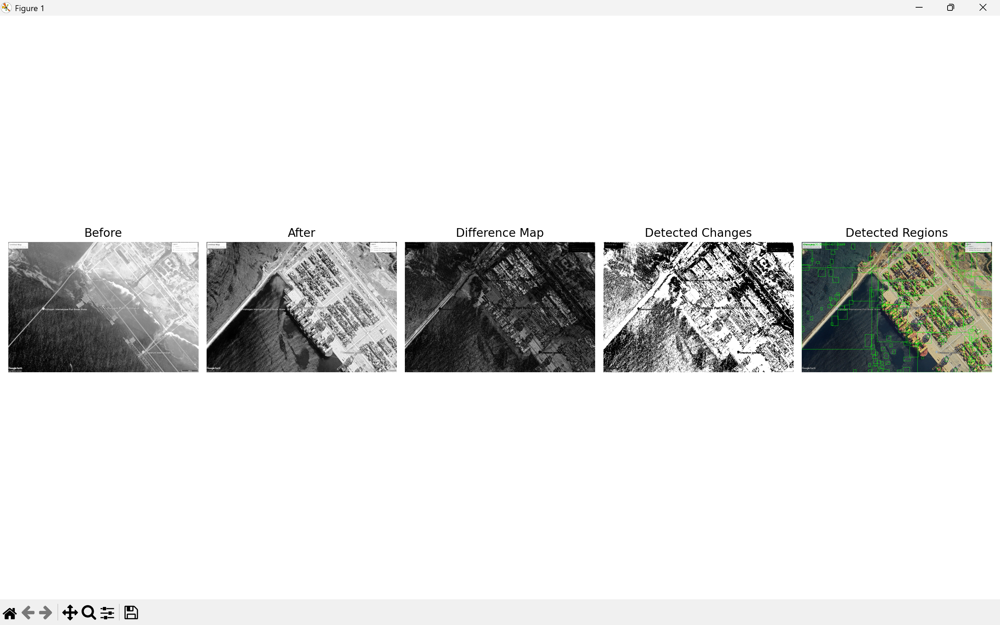

# Satellite Image Change Detection System

A computer vision project that detects and quantifies changes between satellite images taken at different points in time. The system uses image processing techniques to identify changed regions, calculate change statistics, and visualize the results.

## Overview

Satellite imagery is widely used for monitoring urban growth, infrastructure development, environmental changes, and land-use patterns. This project implements a change detection pipeline using Python and OpenCV to automatically identify differences between two images of the same location.

## Features

* Load and preprocess satellite images
* Convert images to grayscale for analysis
* Generate difference maps
* Apply threshold-based change detection
* Remove noise using morphological operations
* Detect changed regions using contour extraction
* Draw bounding boxes around significant changes
* Calculate percentage area changed
* Configurable detection parameters
* Visualize results in a multi-panel comparison view

## Project Structure

```text
satellite-change-detection/
│
├── data/
│   ├── before/
│   └── after/
│
├── results/
│
├── src/
│   ├── image_loader.py
│   ├── preprocessing.py
│   ├── change_detector.py
│   └── config.py
│
├── requirements.txt
├── .gitignore
├── README.md
└── main.py
```

## Technologies Used

* Python
* OpenCV
* NumPy
* Matplotlib

## Pipeline

```text
Input Images
      ↓
Image Loading
      ↓
Grayscale Conversion
      ↓
Difference Calculation
      ↓
Thresholding
      ↓
Noise Removal
      ↓
Contour Detection
      ↓
Bounding Box Generation
      ↓
Change Statistics
```

## Configuration

Project parameters can be modified in `src/config.py`.

Example:

```python
MIN_CONTOUR_AREA = 500
THRESHOLD_VALUE = 30
```

## Sample Workflow

1. Place the earlier image in:

```text
data/before/
```

2. Place the later image in:

```text
data/after/
```

3. Run:

```bash
python main.py
```

4. View:

   * Before image
   * After image
   * Difference map
   * Binary change map
   * Detected regions

## Case Study: Vizhinjam Port Development

A real-world test was conducted using satellite imagery of Vizhinjam Port, Kerala, captured at different stages of development.

Observed changes include:

* Port infrastructure expansion
* Increased container storage areas
* Road network development
* Coastal construction activity

The system successfully detected large-scale structural changes and quantified the affected area.

## Sample Output



## Current Limitations

* Sensitive to image misalignment
* Affected by lighting and contrast differences
* Uses threshold-based detection only
* Requires images of the same dimensions

## Future Improvements

* Automatic image alignment using ORB feature matching
* Image registration and homography transformation
* NDVI-based vegetation analysis
* Geospatial metadata support
* Interactive web dashboard using FastAPI
* Automated report generation
* Multi-temporal change analysis

## Learning Outcomes

This project demonstrates:

* Computer Vision
* Image Processing
* Change Detection
* Data Visualization
* Software Engineering Practices
* Earth Observation Concepts

## Author

Developed as part of a personal Earth Observation and Aerospace Software Engineering portfolio project.
